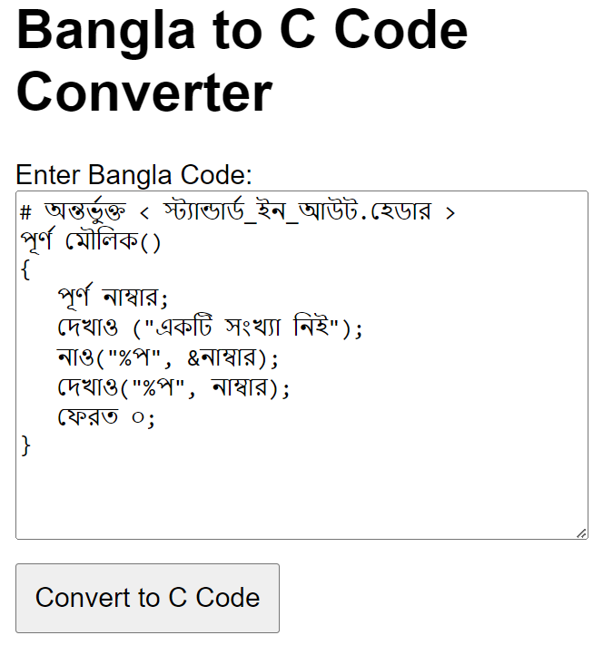

# Github Page: 
[```Bangla Code to Code Converter```](https://anisurrahmanlikhon.github.io/Bangla-Code-to-C-Converter/)
# ডকুমেন্টেশন




### সিনট্যাক্স 

```Perl
# অন্তর্ভুক্ত < স্ট্যান্ডার্ড_ইন_আউট.হেডার >
পূর্ণ মৌলিক()
{
   দেখাও("ওহে বিশ্ব");
   ফেরত ০;
}
```


- ```# অন্তর্ভুক্ত < স্ট্যান্ডার্ড_ইন_আউট.হেডার >``` হচ্ছে C language এ হেডার ফাইল. ```#include<stdio.h>```
- ```পূর্ণ``` হলো ```int``` ও ```মৌলিক()``` হচ্ছে ```main()``` ফাংশন।
- ```দেখাও()``` হচ্ছে ```printf()``` ফাংশন।
- ```ফেরত ০``` হচ্ছে  ```return 0```
  

### ইনপুট ও আউটপুট

```Perl
# অন্তর্ভুক্ত < স্ট্যান্ডার্ড_ইন_আউট.হেডার >
পূর্ণ মৌলিক()
{
   পূর্ণ নাম্বার;
   দেখাও ("একটি সংখ্যা নিই");
   নাও("%প", &নাম্বার);
   দেখাও("%প", নাম্বার);
   ফেরত ০;
}
```

- ```পূর্ণ``` হলো ```int```
-  ```নাম্বার``` হচ্ছে ```চলক``` বা ```Variable``` 
- ```নাও()``` হচ্ছে  ```scanf()``` ফাংশন। ``` &নাম্বার``` হচ্ছে নাম্বার ```চলক``` এর ```মেমোরির লোকেশন```।
- ```%প``` হচ্ছে পূর্ণসংখ্যা বা  ```%d```


### ডেটা টাইপ ও চলক

- ```পূর্ণ``` = পূর্ণসংখ্যা  ```int```
- ```দশম``` = দশমিক ```float```
- ```বর্ণ```  = অক্ষর  ```char```
- ```ডাবল``` = লম্বা দশমিক  ```double```
- ```বর্ণ অ্যারে[]``` = "বাক্য"  ```string```

```Perl
পূর্ণ আইডি = ১৯১১৭;
দশম সিজিপিএ = ৪.৮১;
বর্ণ মালা = 'অ';
ডাবল হিসাব = ১২৩৪৫৬.৭৮৯০;
বর্ণ অ্যারে১[২০] = "মোঃ আনিছুর রহমান";
```

### ফরমেট স্ট্রিং

- ```পূর্ণ``` = পূর্ণসংখ্যা  ```int``` এর ফরমেট স্ট্রিং হচ্ছে ```%প```
- ```দশম``` = দশমিক ```float``` এর ফরমেট স্ট্রিং হচ্ছে ```%দ```
- ```বর্ণ```  = অক্ষর  ```char``` এর ফরমেট স্ট্রিং হচ্ছে ```%ব```
- ```ডাবল``` = লম্বা দশমিক  ```double``` এর ফরমেট স্ট্রিং হচ্ছে ```%লদ```
- ```বর্ণ অ্যারে[]``` = "বাক্য"  ```string``` এর ফরমেট স্ট্রিং হচ্ছে ```%স```

```Perl
# অন্তর্ভুক্ত < স্ট্যান্ডার্ড_ইন_আউট.হেডার >
# অন্তর্ভুক্ত < স্ট্যান্ডার্ড_লাইব্রেরি.হেডার >
# অন্তর্ভুক্ত < স্ট্রিং.হেডার >
# অন্তর্ভুক্ত < গণিত.হেডার >

পূর্ণ মৌলিক()
{
   পূর্ণ নাম্বার = ১০০;
   দশম সিজিপিএ = ৫.০০;
   বর্ণ ইংরেজি = 'A';
   ডাবল হিসাব = ১২৩৪৫.৬৭৮৯০;
   বর্ণ অ্যারে[১০০]="মোঃ আনিছুর রহমান";
   
   দেখাও("%প\n", নাম্বার);
   দেখাও("%দ\n", সিজিপিএ);
   দেখাও("%ব\n", ইংরেজি);
   দেখাও("%লদ\n", হিসাব);
   দেখাও("%স\n", অ্যারে);
   
   ফেরত ০;
}
```

```Perl
# অন্তর্ভুক্ত < স্ট্যান্ডার্ড_ইন_আউট.হেডার >
# অন্তর্ভুক্ত < স্ট্যান্ডার্ড_লাইব্রেরি.হেডার >
# অন্তর্ভুক্ত < স্ট্রিং.হেডার >
# অন্তর্ভুক্ত < গণিত.হেডার >

শূণ্য মৌলিক()
{
   অটো পূর্ণ ক = ১০; 
   খাটো পূর্ণ খ = ৩২৭২০; 
   লম্বা পূর্ণ গ = ২১৭৪৪৮৩৬৪৮;
   চিহ্ন পূর্ণ ঘ = -১২৩;
   প্রতীকহীন পূর্ণ ঙ = ৪৫৬;
   ভুলাটাইল পূর্ণ চ = ৭৮৯;
   
   দেখাও("ক: %প\n", ক);
   দেখাও("খ: %প\n", খ);
   দেখাও("গ: %লপ\n", গ);
   দেখাও("ঘ: %প\n", ঘ);
   দেখাও("ঙ: %ইউ\n", ঙ);
   দেখাও("চ: %প\n", চ);
   
}
```

### ডেটা টাইপ মেমোরির সাইজ

|চলক    |সাইজ          |
|-----------------|-------------------|
| ```পূর্ণ```       | ২-৪ বাইট          |
| ```দশম```       | ২-৪ বাইট            |
| ```বর্ণ```      | ১ বাইট            |
| ```ডাবল``` | ৮ বাইট |
|```বর্ণ অ্যারে[]```| অ্যারের সাইজ অনুযায়ী |

### গ্লোবাল ও লোকাল ভেরিয়েবল 
```Perl
# অন্তর্ভুক্ত < স্ট্যান্ডার্ড_ইন_আউট.হেডার >
# অন্তর্ভুক্ত < স্ট্যান্ডার্ড_লাইব্রেরি.হেডার >
# অন্তর্ভুক্ত < স্ট্রিং.হেডার >
# অন্তর্ভুক্ত < গণিত.হেডার >

   পূর্ণ গ্লোবাল = ১০;
   শূণ্য ফাংশন()
   {
     পূর্ণ লোকাল = ২০;
     দেখাও("লোকাল: %প\n", লোকাল);
   }

পূর্ণ মৌলিক()
{
  পূর্ণ লোকাল = ৩০;
  দেখাও("গ্লোবাল: %প\n", গ্লোবাল);
  ফাংশন();
  দেখাও("লোকাল: %প\n", লোকাল);
  ফেরত ০;
}
   
```
```Perl
# অন্তর্ভুক্ত < স্ট্যান্ডার্ড_ইন_আউট.হেডার >
# অন্তর্ভুক্ত < স্ট্যান্ডার্ড_লাইব্রেরি.হেডার >
# অন্তর্ভুক্ত < স্ট্রিং.হেডার >
# অন্তর্ভুক্ত < গণিত.হেডার >

 এক্সটার্ণ পূর্ণ গ্লোবাল = ১০;
   শূণ্য ফাংশন()
   {
    রেজিস্টার পূর্ণ লোকাল = ২০;
     দেখাও("লোকাল: %প\n", লোকাল);
   }

পূর্ণ মৌলিক()
{
  রেজিস্টার পূর্ণ লোকাল = ৩০;
  দেখাও("গ্লোবাল: %প\n", গ্লোবাল);
  ফাংশন();
  দেখাও("লোকাল: %প\n", লোকাল);
  ফেরত ০;
}
   
```
###  নির্দিষ্ট ও স্ট্যাটিক ভেরিয়েবল
```Perl
# অন্তর্ভুক্ত < স্ট্যান্ডার্ড_ইন_আউট.হেডার >
# অন্তর্ভুক্ত < স্ট্যান্ডার্ড_লাইব্রেরি.হেডার >
# অন্তর্ভুক্ত < স্ট্রিং.হেডার >
# অন্তর্ভুক্ত < গণিত.হেডার >

   শূণ্য ফাংশন()
   {
    স্ট্যাটিক পূর্ণ খ = ১০;
    দেখাও("পরিবর্তনশীল মান: %প\n", খ);
    খ += ১০;
   }

পূর্ণ মৌলিক()
{
  নির্দিষ্ট পূর্ণ ক = ২০;// মানটি অপরিবর্তনশীল
  দেখাও("অপরিবর্তনশীল মান: %প\n", ক);
  ফাংশন();
  ফাংশন();
  ফাংশন();
  ফাংশন();
  ফাংশন();

  ফেরত ০;
}
```
### শর্ত
if-else
```Perl
# অন্তর্ভুক্ত < স্ট্যান্ডার্ড_ইন_আউট.হেডার >
# অন্তর্ভুক্ত < স্ট্যান্ডার্ড_লাইব্রেরি.হেডার >
# অন্তর্ভুক্ত < স্ট্রিং.হেডার >
# অন্তর্ভুক্ত < গণিত.হেডার >

পূর্ণ মৌলিক()
{
   পূর্ণ ক = ১০;
   পূর্ণ খ = ২০;

   যদি(ক<খ)
   { 
    দেখাও("ক, খ এর চেয়ে ছোট");
   }
   নাহলে
   {
    দেখাও("ক, খ এর চেয়ে বড়");
   }

   ফেরত ০;
}
```
if else-if else

```Perl
# অন্তর্ভুক্ত < স্ট্যান্ডার্ড_ইন_আউট.হেডার >
# অন্তর্ভুক্ত < স্ট্যান্ডার্ড_লাইব্রেরি.হেডার >
# অন্তর্ভুক্ত < স্ট্রিং.হেডার >
# অন্তর্ভুক্ত < গণিত.হেডার >

পূর্ণ মৌলিক()
{
   পূর্ণ ক = ২৫;
   পূর্ণ খ = ২০;

   যদি(ক<খ)
   { 
    দেখাও("ক, খ এর চেয়ে ছোট");
   }
   নাহলে যদি(ক==১৫)
   {
    দেখাও("ক, খ এর চেয়ে ছোটই");
   }
   নাহলে
   {
    দেখাও("ক, খ এর চেয়ে বড়");
   }

   ফেরত ০;
}
```
Switch Case:

```Perl
# অন্তর্ভুক্ত < স্ট্যান্ডার্ড_ইন_আউট.হেডার >
# অন্তর্ভুক্ত < স্ট্যান্ডার্ড_লাইব্রেরি.হেডার >
# অন্তর্ভুক্ত < স্ট্রিং.হেডার >
# অন্তর্ভুক্ত < গণিত.হেডার >

পূর্ণ মৌলিক()
{
  বর্ণ অপারেটর;
  দশম নাম্বার১, নাম্বার২, ফলাফল;

  দেখাও("একটি অপারেটর নিই(+,-,*,/): ");
  নাও("%ব", &অপারেটর);

  দেখাও("দুইটি সংখ্যা নিই: ");
  নাও("%দ""%দ" , &নাম্বার১, &নাম্বার২);

  সুইচ(অপারেটর)
    {
      কেস '+':
      ফলাফল = নাম্বার১ + নাম্বার২;
      থামো;

      কেস '-':
      ফলাফল = নাম্বার১ - নাম্বার২;
      থামো;

      কেস '*':
      ফলাফল = নাম্বার১ * নাম্বার২;
      থামো;

      কেস '/':
      ফলাফল = (দশম)নাম্বার১/নাম্বার২;
      থামো;

      ডিফল্ট:
      দেখাও("ত্রুটিযুক্ত প্রোগ্রাম! অবৈধ অপারেটর প্রয়োগ\n");
      থামো;
    }
দেখাও("ফলাফলটি হলো: %.২ঘদ", ফলাফল);
ফেরত ০;
}

```

### লুপ
for loop:

```Perl
# অন্তর্ভুক্ত < স্ট্যান্ডার্ড_ইন_আউট.হেডার >
# অন্তর্ভুক্ত < স্ট্যান্ডার্ড_লাইব্রেরি.হেডার >
# অন্তর্ভুক্ত < স্ট্রিং.হেডার >
# অন্তর্ভুক্ত < গণিত.হেডার >

পূর্ণ মৌলিক()
{
   পূর্ণ ক;
   পূর্ণ খ;
   পূর্ণ গ;
   দেখাও("একটি নাম্বার নিই:");
   নাও("%প", &গ);

   ফর(ক=১; ক<=গ; ক++)
   {
     ফর(খ=১; খ<=ক; খ++)
       {
         দেখাও("%প ", খ);
       }

       দেখাও("\n");
   }

   ফেরত ০;
}
```
while loop:
```Perl
# অন্তর্ভুক্ত < স্ট্যান্ডার্ড_ইন_আউট.হেডার >
# অন্তর্ভুক্ত < স্ট্যান্ডার্ড_লাইব্রেরি.হেডার >
# অন্তর্ভুক্ত < স্ট্রিং.হেডার >
# অন্তর্ভুক্ত < গণিত.হেডার >

পূর্ণ মৌলিক()
{
   পূর্ণ ক = ১;
   যতক্ষণ (ক<১০)
   { 
    দেখাও("আমি কাজে করে যাব\n");
    ক++;
   }
  ফেরত ০;
}
```
do while loop:
```Perl
# অন্তর্ভুক্ত < স্ট্যান্ডার্ড_ইন_আউট.হেডার >
# অন্তর্ভুক্ত < স্ট্যান্ডার্ড_লাইব্রেরি.হেডার >
# অন্তর্ভুক্ত < স্ট্রিং.হেডার >
# অন্তর্ভুক্ত < গণিত.হেডার >

পূর্ণ মৌলিক()
{
   পূর্ণ ক = ১;
   করো{ 

    দেখাও("আমি কাজে করে যাব\n");
    ক++;

   } যতক্ষণ (ক<১০);

  ফেরত ০;
}
```
break, continue statement:
```Perl
# অন্তর্ভুক্ত < স্ট্যান্ডার্ড_ইন_আউট.হেডার >
# অন্তর্ভুক্ত < স্ট্যান্ডার্ড_লাইব্রেরি.হেডার >
# অন্তর্ভুক্ত < স্ট্রিং.হেডার >
# অন্তর্ভুক্ত < গণিত.হেডার >

পূর্ণ মৌলিক()
{
   পূর্ণ ক = ১;
   ফর(ক=১; ক<=২০; ক++)
   {
      যদি (ক == ১০)
       {
          থামো;
       }
   
     যদি (ক % ২ == ০)
       {
          বাদ;
       }
    দেখাও("%প\n", ক);
    }
ফেরত ০;
}
```
### লাফ_দাও লেবেলে স্টেটমেন্ট
```Perl
# অন্তর্ভুক্ত < স্ট্যান্ডার্ড_ইন_আউট.হেডার >
# অন্তর্ভুক্ত < স্ট্যান্ডার্ড_লাইব্রেরি.হেডার >
# অন্তর্ভুক্ত < স্ট্রিং.হেডার >
# অন্তর্ভুক্ত < গণিত.হেডার >

পূর্ণ মৌলিক()
{
   পূর্ণ ক;
   পূর্ণ খ;
   ফর(ক = ১; ক <= ৩; ক++) 
   {
     ফর(খ = ১; খ <= ৩; খ++)
       {
         দেখাও("%প %প\n", ক, খ);
         যদি (ক == ২ && খ == ২)
           {
              লাফ_দাও লেবেল;
           }
       }
   }
লেবেল:
দেখাও("লাফ দাও দ্বারা লুপের সমাপ্তি হলো");
ফেরত ০;
}
```


### অ্যারে
```Perl
# অন্তর্ভুক্ত < স্ট্যান্ডার্ড_ইন_আউট.হেডার >
# অন্তর্ভুক্ত < স্ট্যান্ডার্ড_লাইব্রেরি.হেডার >
# অন্তর্ভুক্ত < স্ট্রিং.হেডার >
# অন্তর্ভুক্ত < গণিত.হেডার >

পূর্ণ মৌলিক()
{
   পূর্ণ অ্যারে[৫]= {১,২,৩,৪,৫};

   দেখাও("%প\n", অ্যারে[০]);
   দেখাও("%প\n", অ্যারে[১]);
   দেখাও("%প\n", অ্যারে[২]);
   দেখাও("%প\n", অ্যারে[৩]);
   দেখাও("%প\n", অ্যারে[৪]);

 ফেরত ০;
}
```
```Perl
# অন্তর্ভুক্ত < স্ট্যান্ডার্ড_ইন_আউট.হেডার >
# অন্তর্ভুক্ত < স্ট্যান্ডার্ড_লাইব্রেরি.হেডার >
# অন্তর্ভুক্ত < স্ট্রিং.হেডার >
# অন্তর্ভুক্ত < গণিত.হেডার >

পূর্ণ মৌলিক()
{
   পূর্ণ ক, নাম্বার = ১২;
   পূর্ণ অ্যারে[নাম্বার];
   অ্যারে[০] = ১;
   ফর(ক = ১; ক < নাম্বার; ক++)
   {
     অ্যারে[ক] = অ্যারে[ক -১] * ২;
   }
   ফর(ক = ০; ক < নাম্বার; ক++)
   {
     দেখাও("অ্যারে[%প] = %প\n", ক, অ্যারে[ক]);
   }
   ফেরত ০;
}
```
### ফাংশন
Find Square
```Perl
# অন্তর্ভুক্ত < স্ট্যান্ডার্ড_ইন_আউট.হেডার >
# অন্তর্ভুক্ত < স্ট্যান্ডার্ড_লাইব্রেরি.হেডার >
# অন্তর্ভুক্ত < স্ট্রিং.হেডার >
# অন্তর্ভুক্ত < গণিত.হেডার >

পূর্ণ বর্গ(পূর্ণ নাম্বার)
{
  পূর্ণ ফলাফল;
  ফলাফল = নাম্বার * নাম্বার;
  দেখাও("%প এর বর্গ: %প", নাম্বার, ফলাফল);
}
পূর্ণ মৌলিক()
{
  পূর্ণ নাম্বার;
  বর্গ(১০);
}

```
Recursive Factorial
```Perl
# অন্তর্ভুক্ত < স্ট্যান্ডার্ড_ইন_আউট.হেডার >
# অন্তর্ভুক্ত < স্ট্যান্ডার্ড_লাইব্রেরি.হেডার >
# অন্তর্ভুক্ত < স্ট্রিং.হেডার >
# অন্তর্ভুক্ত < গণিত.হেডার >

পূর্ণ ফ্যাক্টরিয়াল(পূর্ণ নাম্বার)
{
  যদি(নাম্বার == ০ || নাম্বার == ১)
  {
     ফেরত ১;
  }
  নাহলে
      {
         ফেরত নাম্বার * ফ্যাক্টরিয়াল(নাম্বার-১);
      }
}
পূর্ণ মৌলিক()
{
  পূর্ণ ফলাফল = ফ্যাক্টরিয়াল(৫);
  দেখাও("৫ এর ফ্যাক্টরিয়াল হলো: %প", ফলাফল);
ফেরত ০;
}
```
Recursive Fibonacci
```Perl
# অন্তর্ভুক্ত < স্ট্যান্ডার্ড_ইন_আউট.হেডার >
# অন্তর্ভুক্ত < স্ট্যান্ডার্ড_লাইব্রেরি.হেডার >
# অন্তর্ভুক্ত < স্ট্রিং.হেডার >
# অন্তর্ভুক্ত < গণিত.হেডার >

পূর্ণ ফিবোনাক্কি(পূর্ণ নাম্বার)
{
  যদি(নাম্বার <= ১)
  {
     ফেরত নাম্বার;
  }
  নাহলে
      {
         ফেরত ফিবোনাক্কি(নাম্বার-১) + ফিবোনাক্কি(নাম্বার-২) ;
      }
}
পূর্ণ মৌলিক()
{
  পূর্ণ ক, নাম্বার = ১০;
  দেখাও("ফিবোনাক্কি সিরিজ: ");
  ফর(ক = ১; ক < নাম্বার; ক++)
  {
    দেখাও("%প ",ফিবোনাক্কি(ক));
  }
ফেরত ০;
}
```
### পয়েন্টার
```Perl
# অন্তর্ভুক্ত < স্ট্যান্ডার্ড_ইন_আউট.হেডার >
# অন্তর্ভুক্ত < স্ট্যান্ডার্ড_লাইব্রেরি.হেডার >
# অন্তর্ভুক্ত < স্ট্রিং.হেডার >
# অন্তর্ভুক্ত < গণিত.হেডার >

পূর্ণ মৌলিক()
{
  পূর্ণ নাম্বার = ১০;
  পূর্ণ* পয়েন্টার = &নাম্বার;
  *পয়েন্টার = ২০;

  পূর্ণ** পয়েন্টার১ = &পয়েন্টার; 
  **পয়েন্টার১ = ৩০;
  দেখাও("নাম্বার: %প", নাম্বার);
  ফেরত ০;
}
```
### পয়েন্টার ও স্ট্রাকচার
```Perl
# অন্তর্ভুক্ত < স্ট্যান্ডার্ড_ইন_আউট.হেডার >
# অন্তর্ভুক্ত < স্ট্যান্ডার্ড_লাইব্রেরি.হেডার >
# অন্তর্ভুক্ত < স্ট্রিং.হেডার >
# অন্তর্ভুক্ত < গণিত.হেডার >

স্ট্রাক্ট পারসন
{
  বর্ণ নাম[৫০];
  বর্ণ আচারণ[৫০];
  স্ট্রাক্ট পারসন* পয়েন্টার১;
  স্ট্রাক্ট পারসন* পয়েন্টার২;
};

শূণ্য রিপোর্ট(স্ট্রাক্ট পারসন* ব্যাক্তি)
{
 দেখাও("%স এর রিপোর্ট:\n", ব্যাক্তি->নাম);
 দেখাও("%স হলো %স\n", ব্যাক্তি->পয়েন্টার১->নাম, ব্যাক্তি->পয়েন্টার১->আচারণ);
 দেখাও("%স হলো %স\n", ব্যাক্তি->পয়েন্টার২->নাম, ব্যাক্তি->পয়েন্টার২->আচারণ);
 দেখাও("\n");
}

পূর্ণ মৌলিক()
{
  স্ট্রাক্ট পারসন ব্যাক্তি১, ব্যাক্তি২, ব্যাক্তি৩;
  বা-কপি(ব্যাক্তি১.নাম, "আনিছ");
  বা-কপি(ব্যাক্তি২.নাম, "আশিক");
  বা-কপি(ব্যাক্তি৩.নাম, "আতিক");
  বা-কপি(ব্যাক্তি১.আচারণ, "পরিশ্রমী");
  বা-কপি(ব্যাক্তি২.আচারণ, "কর্মঠ");
  বা-কপি(ব্যাক্তি৩.আচারণ, "সৃষ্টিশীল");

  ব্যাক্তি১.পয়েন্টার১ = &ব্যাক্তি২;
  ব্যাক্তি১.পয়েন্টার২ = &ব্যাক্তি৩;
  
  ব্যাক্তি২.পয়েন্টার১ = &ব্যাক্তি১;
  ব্যাক্তি২.পয়েন্টার২ = &ব্যাক্তি৩;
  
  ব্যাক্তি৩.পয়েন্টার১ = &ব্যাক্তি১;
  ব্যাক্তি৩.পয়েন্টার২ = &ব্যাক্তি২;

  রিপোর্ট(&ব্যাক্তি১);
  রিপোর্ট(&ব্যাক্তি২);
  রিপোর্ট(&ব্যাক্তি৩);
  ফেরত ০;
}
```

### স্ট্রিং 
```Perl
# অন্তর্ভুক্ত < স্ট্যান্ডার্ড_ইন_আউট.হেডার >
# অন্তর্ভুক্ত < স্ট্যান্ডার্ড_লাইব্রেরি.হেডার >

পূর্ণ মৌলিক()
{
   
   বর্ণ নাম[৫০]= "মোঃ আনিছুর রহমান";
   দেখাও("আপনার নামটি হলো %স\n", নাম);
   ফেরত ০;
}
```
gets(), puts():

```Perl
# অন্তর্ভুক্ত < স্ট্যান্ডার্ড_ইন_আউট.হেডার >
# অন্তর্ভুক্ত < স্ট্যান্ডার্ড_লাইব্রেরি.হেডার >
# অন্তর্ভুক্ত < স্ট্রিং.হেডার >
# অন্তর্ভুক্ত < গণিত.হেডার >

পূর্ণ মৌলিক()
{
   বর্ণ নাম[৫০];

   দেখাও("আপনার নাম লিখুন: ");
   বাক্য_লই(নাম);
   দেখাও("\nআপনার নামটি হলো ");
   বাক্য_দেখাই(নাম);

 ফেরত ০;
}
```
Library Function
```Perl
# অন্তর্ভুক্ত < স্ট্যান্ডার্ড_ইন_আউট.হেডার >
# অন্তর্ভুক্ত < স্ট্যান্ডার্ড_লাইব্রেরি.হেডার >
# অন্তর্ভুক্ত < স্ট্রিং.হেডার >
# অন্তর্ভুক্ত < গণিত.হেডার >

পূর্ণ মৌলিক()
{
   বর্ণ বাক্য১[৫০]="আমি আনিছ";
   বর্ণ বাক্য২[৫০]="আমি মিশুক";
   বর্ণ বাক্য৩[৫০]="আমি আতিক";

   পূর্ণ দৈর্ঘ্য= বা-লেন(বাক্য১);
   দেখাও("বাক্য১ দৈর্ঘ্য: %প\n", দৈর্ঘ্য);

   বা-কপি(বাক্য৩, বাক্য১);
   দেখাও("বাক্য কপি: %স\n",বাক্য৩);

   বা-কেট(বাক্য৩, বাক্য২);
   দেখাও("বাক্য কনকেটেনেশন: %স\n",বাক্য৩);

   
   পূর্ণ ফলাফল = বা-কম( বাক্য১, বাক্য২);
   যদি (ফলাফল == ০)
      {
         দেখাও("বাক্য১ == বাক্য২\n");
      }
    নাহলে যদি(ফলাফল<০)
      {
        দেখাও("বাক্য১ < বাক্য২\n");
      }
     নাহলে
      {
        দেখাও("বাক্য১ > বাক্য২\n");
      }
 ফেরত ০;
}
```
```
বাংলা ক্যারেক্টার সি তার মেমোরিতে রাখতে পারে। তবে ক্যারেক্টারের সঠিক সাইজ পাওয়া যায় না। কারণ সি তে বাংলা ক্যারেক্টারের Ascii value নাই। "আমি আনিছ" এ বাক্যে বাংলা ক্যারেক্টারের সাইজ হলো ৮ । তবে সি তে এর সাইজ হবে ২২ ।
```
### বুলিয়ান ও স্ট্রাকচার
```Perl
# অন্তর্ভুক্ত < স্ট্যান্ডার্ড_ইন_আউট.হেডার >
# অন্তর্ভুক্ত < স্ট্যান্ডার্ড_বুলিয়ান.হেডার >

পূর্ণ মৌলিক()
{
  বুল ব১ = সত্য;
  বুল ব২ = মিথ্যা;
  দেখাও("ব১ : %প\n", ব১);
  দেখাও("ব২ : %প\n", ব২);

স্ট্রাক্ট ডেটা
{
  পূর্ণ ক;
  বুল খ;
};

স্ট্রাক্ট ডেটা উপাত্ত;
উপাত্ত.ক = ১০০;
দেখাও("ক = %প\n", উপাত্ত.ক);
উপাত্ত.খ = মিথ্যা;
দেখাও("খ = %প\n", উপাত্ত.খ);
ফেরত ০;

}
```
### টাইপডেফ ইনুম ও ইউনিয়ন
```Perl
# অন্তর্ভুক্ত < স্ট্যান্ডার্ড_ইন_আউট.হেডার >
# অন্তর্ভুক্ত < স্ট্যান্ডার্ড_লাইব্রেরি.হেডার >
# অন্তর্ভুক্ত < স্ট্রিং.হেডার >
# অন্তর্ভুক্ত < গণিত.হেডার >

টাইপ_ডেফ ইনুম
{
  লাল,
  সবুজ,
  নীল
} রং;

টাইপ_ডেফ ইউনিয়ন
{
  পূর্ণ ক;
  পূর্ণ খ;
} ডেটা;

পূর্ণ মৌলিক()
{
  রং পছন্দ_রং = সবুজ;
  ডেটা সংখ্যা;
  সংখ্যা.ক = ১০০;
  দেখাও("আমার পছন্দের রং হলো %প\n", পছন্দ_রং + ১);
  দেখাও("সংখ্যাটি হলো %প", সংখ্যা.ক);
  ফেরত ০;
}
```

### বাংলা থেকে সি কনভার্টার

[<b>```বাংলা থেকে সি কনভার্টার```</b>](https://bangla-code-to-c-code-coverter.mdanisuranisur.repl.co/)

### বা</>কোডিং- বাংলায় কোডিং শিখুন
```জাভা স্ক্রিপ্ট``` সম্বলিত, ```চা-স্ক্রিপ্ট``` থেকে নির্মিত আমার [<b>```বা</>কোডিং```</b>](https://anisurrahmanlikhon.github.io/Ba-Coding/)


### বাংলা সি ইডিটর
<b>```বাংলা সি ইডিটর```</b> তৈরীর কাজ চলতেছে। আমরা শীঘ্রই <b>```বাংলা সি ইডিটর```</b> কে নিয়ে হাজির হবো ইনশাল্লাহ।


